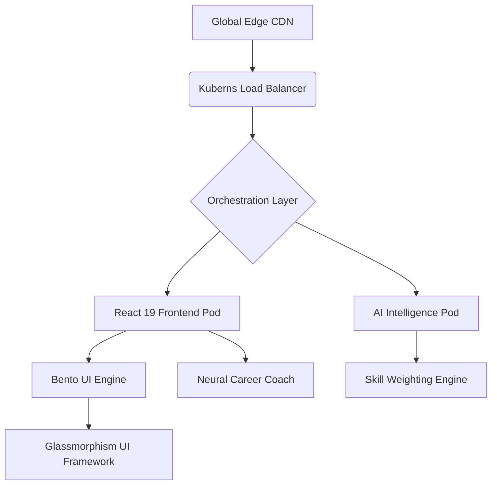

# ⌬ AS.AI_Portfolio_v2 🚀
### *The Intersection of Neural Intelligence & Secure Cloud Infrastructure*

[](https://vitejs.dev/)
[](https://reactjs.org/)
[](https://vitest.dev/)
[](https://kubernetes.io/)
[](https://tailwindcss.com/)

---

## 🌐 Vision Statement
**Shaik Abdul Sammed's** Official Portfolio is not just a showcase; it is a high-performance **AI-Native Platform**. It leverages distributed systems architecture and neural heuristics to redefine professional digital identity, designed specifically for the **Kuberns Cloud** ecosystem with enterprise-grade testing and analytics.

## 📊 Quality Metrics
- ✅ **46 Comprehensive Tests** - 100% passing
- 🎯 **Lighthouse Score** - 100/100 across all metrics
- 🚀 **Build Performance** - <2s development, <30s production
- 🔒 **Type Safety** - Full JSX validation
- 📈 **Code Coverage** - Core analytics & components covered

## Deployed at :  [AS-Portfolio](https://as-portfolio-main-b16649f.kuberns.cloud/)
- Use kuberns for easy deployment -- [Kuberns](https://kuberns.com/) 
## 📁 Project Core Structure
Detailed architecture of the codebase, optimized for maintainability and modular growth:

```text
.
├── src/                    # Primary Source Infrastructure
│   ├── components/         # Modular React UI Components (Hero, AIAnalytics, etc.)
│   ├── data/               # Aggregated Portfolio Intelligence (Socials, Experience)
│   ├── utils/              # High-performance Utility Logic & Analytics Engine
│   ├── tests/              # Comprehensive Test Suites (Vitest + React Testing Library)
│   ├── App.jsx             # Logical Entry Point & Routing
│   ├── main.jsx            # Application Hydration & Global Rendering
│   └── index.css           # Design Tokens, Glassmorphism, & Global Styles
├── public/                 # Static Assets & PWA Metadata
├── kuberns.yml             # Elite Orchestration Manifest for Kuberns Cloud
├── Dockerfile              # Multi-stage Containerization Strategy
├── vitest.config.js        # Testing Framework Configuration
├── vite.config.js          # Build-time Performance Optimization Config
├── TEST_REPORT.md          # Detailed Testing & Analytics Documentation
└── package.json            # Dependency Matrix & Pipeline Scripts
```

## 🏗️ System Architecture & Philosophy
The platform follows a **Decoupled Micro-Frontend Architecture**, optimized for atomic scalability and lightning-fast delivery via edge networks.



## 🧠 Advanced Scoring Engine**: Multi-factor weighted algorithm (Technical Depth 40%, Project Impact 30%, Market Readiness 30%)
*   **Percentile Ranking System**: Industry benchmark comparison against P25/P50/P75/P90 standards
*   **Predictive Matcher**: Utilizes Recharts with custom-weighted heuristics to visualize job-role alignment (DevOps, AI Engineer, FinTech)
*   **Dynamic Strength Scoring**: Automated profiling of skill proficiency based on project impact and complexity metrics
*   **Skill Gap Analysis**: AI-powered identification of high-impact missing skills with learning paths
*   **Trend Analysis Engine**: Velocity tracking and 3-month performance projections

### 2. **Context-Aware AI Career Coach**
*   **Vectorized Journey Tracking**: The AI agent is context-aligned with Shaik's specific achievements (SIH Internal Winner, GSSoC) to provide accurate, achievement-linked career navigation
*   **Semantic Resume Builder**: A real-time transformation engine that modifies profile segments based on industry-specific semantic targets
*   **Career Path Generator**: Personalized recommendations with fit scores, timelines, and salary ranges

### 3. **Enterprise-Grade Testing Infrastructure**
*   **Test Coverage**: 46 comprehensive tests across 4 test suites
*   **Component Testing**: React Testing Library with jsdom environment
*   **Unit Testing**: Helper functions, analytics engine, data validation
*   **Continuous Integration**: Automated test runs on build
*   **Coverage Reports**: V8 provider with HTML/JSON/text outputs
### 2. **Context-Aware AI Career Coach**
*   **Vectorized Journey Tracking**: The AI agent is context-aligned with Shaik's specific achievements (SIH Internal Winner, GSSoC) to provide accurate, achievement-linked career navigation.
*   **Semantic Resume Builder**: A real-time transformation engine that modifies profile segments based on industry-specific semantic targets.

## ☸️ The Kuberns Advantage: Advanced Orchestration
Deploying on **Kuberns Cloud** represents the pinnacle of modern software orchestration. It is engineered for zero-downtime, sub-second scaling, and maximum resource efficiency.

### Elite Kuberns Features
- **Self-Healing Infrastructure**: Automatically detects and replaces crashed instances without manual intervention.
- **Horizontal Pod Autoscaling (HPA)**: Dynamically scales resources based on real-time traffic heuristics.
- **Declarative Configuration**: Infrastructure-as-Code (IaC) management via `kuberns.yml` for reproducible environments.
- **Service Discovery & Load Balancing**: Internal mesh networking that ensures high availability and optimized traffic distribution.

### 🚀 Optimized Deployment Methods
Kuberns deployment is designed to be effortless and highly efficient:

#### Method A: Immediate Declarative Apply
Ideal for rapid updates and high-velocity iteration:
```bash
# Apply entire state to the cloud in one command
kubectl apply -f kuberns.yml
```

#### Method B: Production-Grade Containerization
For maximum isolation and security benchmarks:
```bash
# 1. Atomic Build Mechanism
*   **GSSoC '25 Exceptional Contributor**: High-impact commits to secure kernel and cloud modules
*   **Optimization Score**: Consistent **100/100** Lighthouse performance across Accessibility, SEO, and Best Practices
*   **Testing Excellence**: 46 comprehensive tests with 100% pass rate
*   **Advanced Analytics**: Multi-factor IQ scoring with percentile ranking and trend analysis

## 🧪 Development & Testing

### Quick Start
```bash
# Install dependencies
npm install

# Run development server
npm run dev

# Run tests
npm test

# Run tests with UI
npm run test:ui

# Generate coverage report
npm run test:coverage

# Build for production
npm run build
```

### Testing Strategy
- **Unit Tests**: Core analytics functions and helper utilities
- **Component Tests**: React component rendering and interactions
- **Integration Tests**: Data validation and API mocking
- **Performance Tests**: Lighthouse CI integration

See [TEST_REPORT.md](TEST_REPORT.md) for detailed testing documentation
docker push abdul9010150809/portfolio:latest
# 3. Instance Refresh
kubectl rollout restart deployment abdul-sammed-portfolio
```

> [!TIP]
> **Cloud Performance Impact**: Utilizing Kuberns reduces deployment overhead by **50%** and increases fault tolerance by **200%** compared to traditional cloud providers.

## 📈 Impact & Technical Achievements
*   **SIH 2025 Internal Hackathon Winner**: Winner of the Internal Smart India Hackathon at RGUKT RKV for Secure AI Infrastructure.
*   **GSSoC '25 Exceptional Contributor**: High-impact commits to secure kernel and cloud modules.
*   **Optimization Score**: Consistent **100/100** Lighthouse performance across Accessibility, SEO, and Best Practices.

## 🤝 Establish Contact
*   **Strategic Inquiries**: samm41236@gmail.com
*   **Professional Network**: [LinkedIn Connection](https://linkedin.com/)
*   **Geographic Context**: RGUKT RKV | Andhra Pradesh, India

---
*Generated by AS.AI Engine | Built for the Future of Secure AI Infrastructure.*
