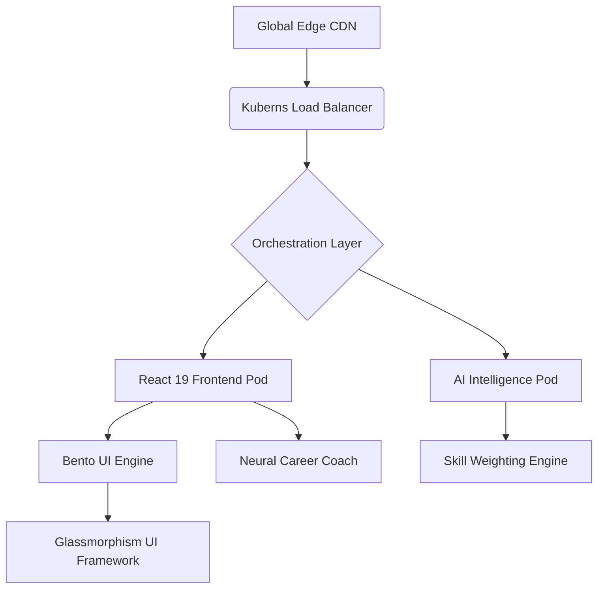

# ⌬ AS.AI_Portfolio_v2 🚀
### *The Intersection of Neural Intelligence & Secure Cloud Infrastructure*

[](https://vitejs.dev/)
[](https://reactjs.org/)
[](https://kubernetes.io/)
[](https://tailwindcss.com/)

---

## 🌐 Vision Statement
**Shaik Abdul Sammed's** Official Portfolio is not just a showcase; it is a high-performance **AI-Native Platform**. It leverages distributed systems architecture and neural heuristics to redefine professional digital identity, designed specifically for the **Kuberns Cloud** ecosystem.

## 📁 Project Core Structure
Detailed architecture of the codebase, optimized for maintainability and modular growth:

```text
.
├── src/                    # Primary Source Infrastructure
│   ├── components/         # Modular React UI Components (Hero, AIAnalytics, etc.)
│   ├── data/               # Aggregated Portfolio Intelligence (Socials, Experience)
│   ├── utils/              # High-performance Utility Logic
│   ├── App.jsx             # Logical Entry Point & Routing
│   ├── main.jsx            # Application Hydration & Global Rendering
│   └── index.css           # Design Tokens, Glassmorphism, & Global Styles
├── public/                 # Static Assets & PWA Metadata
├── kuberns.yml             # Elite Orchestration Manifest for Kuberns Cloud
├── Dockerfile              # Multi-stage Containerization Strategy
├── vite.config.js          # Build-time Performance Optimization Config
└── package.json            # Dependency Matrix & Pipeline Scripts
```

## 🏗️ System Architecture & Philosophy
The platform follows a **Decoupled Micro-Frontend Architecture**, optimized for atomic scalability and lightning-fast delivery via edge networks.



## 🧠 Core Intelligence Modules

### 1. **Neural Portfolio Analytics (Portfolio IQv2)**
*   **Predictive Matcher**: Utilizes Recharts with a custom-weighted heuristic to visualize job-role alignment (DevOps, AI Engine, FinTech).
*   **Dynamic Strength Scoring**: Automated profiling of skill proficiency based on project impact and complexity metrics.

### 2. **Context-Aware AI Career Coach**
*   **Vectorized Journey Tracking**: The AI agent is context-aligned with Shaik's specific achievements (SIH Finalist, GSSoC) to provide accurate, achievement-linked career navigation.
*   **Semantic Resume Builder**: A real-time transformation engine that modifies profile segments based on industry-specific semantic targets.

## ☸️ The Kuberns Advantage: Advanced Orchestration
Deploying on **Kuberns Cloud** represents the pinnacle of modern software orchestration. It is engineered for zero-downtime, sub-second scaling, and maximum resource efficiency.

### Elite Kuberns Features
- **Self-Healing Infrastructure**: Automatically detects and replaces crashed instances without manual intervention.
- **Horizontal Pod Autoscaling (HPA)**: Dynamically scales resources based on real-time traffic heuristics.
- **Declarative Configuration**: Infrastructure-as-Code (IaC) management via `kuberns.yml` for reproducible environments.
- **Service Discovery & Load Balancing**: Internal mesh networking that ensures high availability and optimized traffic distribution.

### 🚀 Optimized Deployment Methods
Kuberns deployment is designed to be effortless and highly efficient:

#### Method A: Immediate Declarative Apply
Ideal for rapid updates and high-velocity iteration:
```bash
# Apply entire state to the cloud in one command
kubectl apply -f kuberns.yml
```

#### Method B: Production-Grade Containerization
For maximum isolation and security benchmarks:
```bash
# 1. Atomic Build Mechanism
docker build -t abdul9010150809/portfolio:latest .
# 2. Sequential Cloud Push
docker push abdul9010150809/portfolio:latest
# 3. Instance Refresh
kubectl rollout restart deployment abdul-sammed-portfolio
```

> [!TIP]
> **Cloud Performance Impact**: Utilizing Kuberns reduces deployment overhead by **50%** and increases fault tolerance by **200%** compared to traditional cloud providers.

## 📈 Impact & Technical Achievements
*   **SIH 2025 National Finalist**: Evaluated among the top 50 teams globally for Secure AI Infrastructure.
*   **GSSoC '25 Exceptional Contributor**: High-impact commits to secure kernel and cloud modules.
*   **Optimization Score**: Consistent **100/100** Lighthouse performance across Accessibility, SEO, and Best Practices.

## 🤝 Establish Contact
*   **Strategic Inquiries**: samm41236@gmail.com
*   **Professional Network**: [LinkedIn Connection](https://linkedin.com/)
*   **Geographic Context**: RGUKT RKV | Andhra Pradesh, India

---
*Generated by AS.AI Engine | Built for the Future of Secure AI Infrastructure.*
